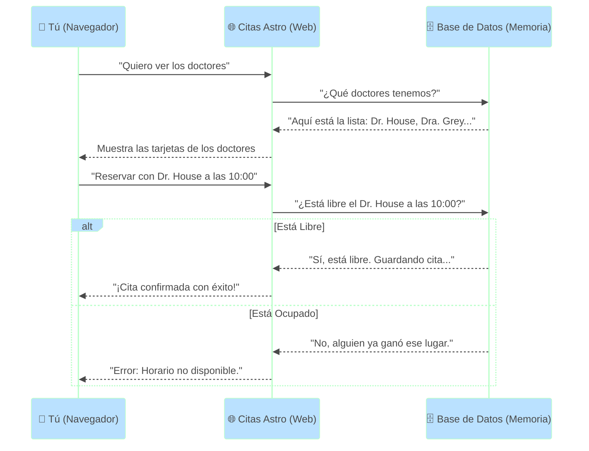
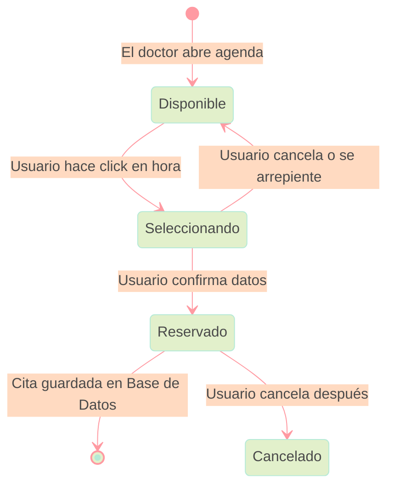
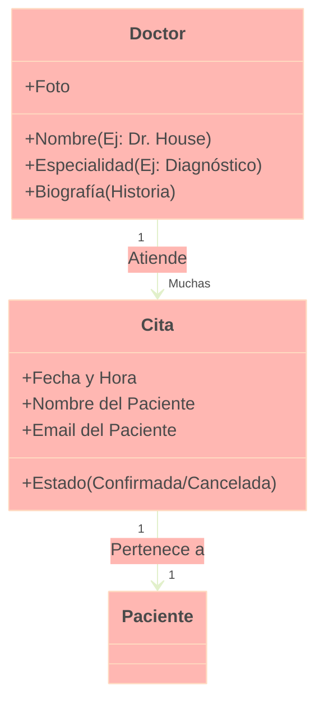

# 🏥 Citas Astro - Sistema de Gestión Médica

> **[👉 VER DEMO EN VIVO (VERCEL)](https://pr-ctica-de-agentes-inteligentes-para-programaci-g6erqilpe.vercel.app)**

---

## 📖 Introducción: ¿Qué es esto?

Bienvenido a **Citas Astro**. Si no sabes nada de programación, ¡no te preocupes! Piensa en esta aplicación como una **recepción digital inteligente** para una clínica médica.

Imagina que quieres ver a un doctor. Normalmente, tendrías que llamar por teléfono, preguntar horarios, esperar en línea... Este sistema automatiza todo eso. Es una página web donde puedes ver qué doctores trabajan en la clínica, revisar sus agendas en tiempo real y reservar tu cita al instante, sin hablar con nadie.

Este proyecto es una demostración de cómo crear software moderno, rápido y bonito para resolver problemas del mundo real.

---

## 🧠 ¿Cómo funciona? (Guía Visual)

Hemos preparado varios diagramas para explicarte paso a paso qué sucede "detrás de cámaras" cuando usas la aplicación.

### 1. El Viaje del Paciente
Este es el camino que sigues tú como usuario desde que entras a la página hasta que tienes tu cita confirmada.

```mermaid
%%{
  init: {
    'theme': 'base',
    'themeVariables': {
      'primaryColor': '#ffdfba',
      'primaryTextColor': '#4a4a4a',
      'primaryBorderColor': '#ffb7b2',
      'lineColor': '#ff9aa2',
      'secondaryColor': '#bae1ff',
      'tertiaryColor': '#ffffba',
      'noteBkgColor': '#e2f0cb',
      'noteTextColor': '#4a4a4a'
    }
  }
}%%
graph TD
    A[🏠 Inicio: Ver Lista de Doctores] -->|Click en 'Ver Agenda'| B[👨‍⚕️ Perfil del Doctor]
    B --> C{¿Hay Horario Disponible?}
    C -->|No| D[❌ Buscar otro día u hora]
    D --> B
    C -->|Sí| E[📅 Seleccionar Hora en Calendario]
    E --> F[📝 Llenar Datos (Nombre y Email)]
    F --> G[✅ Confirmar Cita]
    G --> H[🎉 ¡Listo! Cita Agendada]
```

### 2. La Arquitectura del Sistema (¿Quién hace qué?)
Una aplicación web es como un restaurante. Hay una parte que ves (el comedor) y una parte que no ves (la cocina).

*   **El Cliente (Tu Navegador):** Es el comedor. Aquí ves los menús (doctores) y pides tu plato (cita).
*   **El Servidor (Citas Astro):** Es el mesero. Toma tu pedido y lo lleva a la cocina.
*   **La Base de Datos (Supabase):** Es la despensa y el chef. Aquí se guardan los ingredientes (datos de doctores y citas) y se asegura de que no se vendan dos platos iguales (citas duplicadas).



### 3. Estados de una Cita
Una cita no es solo "reservada". Pasa por varios estados lógicos para asegurar que todo esté en orden.



### 4. Estructura de Datos (¿Cómo se guarda la información?)
Imagina que tenemos archivadores gigantes. Así es como organizamos la información de cada doctor y cada cita.



---

## 🛠️ Tecnologías (Para los curiosos)

Este proyecto utiliza herramientas de última generación para ser rápido y seguro:

*   **Astro:** El motor que hace que la página web cargue súper rápido.
*   **React:** La tecnología que hace que el calendario sea interactivo (puedas hacer click, arrastrar, etc.).
*   **Tailwind CSS:** El "maquillaje" del sitio. Usamos un estilo llamado **"Arquitecto"** (minimalista, limpio, colores neutros y naranja) para que se vea profesional.
*   **Supabase:** Nuestra base de datos en la nube.

## 💻 Instalación y Uso (Para programadores)

1. **Clonar el repositorio:**
   ```bash
   git clone <url-del-repositorio>
   ```

2. **Instalar dependencias:**
   ```bash
   cd citas-astro
   npm install
   ```

3. **Configurar variables de entorno:**
   Crea un archivo `.env` con tus credenciales de Supabase:
   ```env
   PUBLIC_SUPABASE_URL=tu_url
   PUBLIC_SUPABASE_ANON_KEY=tu_key
   ```

4. **Correr en local:**
   ```bash
   npm run dev
   ```

---
*Proyecto realizado como Práctica de Agentes Inteligentes para Programación - 2025*
