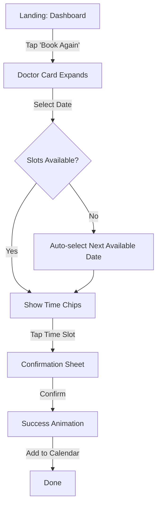

# UX Design Specification Práctica de Agentes Inteligentes para Programación

**Author:** Carlos
**Date:** 2025-12-01

---

## Executive Summary

### Project Vision
"Citas Astro" aims to redefine the medical booking experience by merging the speed of Astro with a "Premium SaaS" aesthetic. The goal is to move away from sterile, generic medical interfaces and create a warm, human-centric, and highly interactive experience that feels handcrafted, using principles of "Anti-Design," Glassmorphism, and physics-based motion.

### Target Users
Primary users are patients seeking efficient medical care. They are tech-savvy enough to appreciate a modern interface but require absolute clarity and trust. They value an experience that feels responsive, "alive," and reassuringly professional.

### Key Design Challenges
- **The "Uncanny Valley" of AI Design:** Avoiding the generic, soulless look of standard AI-generated templates by injecting intentional imperfection and texture.
- **Visual Weight vs. Performance:** Implementing rich visual effects (blur, noise, shadows) without compromising the strict performance goals (Core Web Vitals).
- **Trust in Asymmetry:** Using asymmetrical "Bento" layouts while maintaining the perceived order and reliability expected in a medical context.

### Design Opportunities
- **Tactile Booking:** Transforming the mundane act of clicking a time slot into a delightful, tactile interaction using spring animations and sound design.
- **Emotional Connection:** Using expressive typography and "dopamine colors" to reduce the anxiety often associated with medical appointments.
- **Brand Authority:** Establishing immediate authority and premium positioning through a distinct, non-standard visual language.

### Party Mode Consensus (Technical & Visual Direction)
- **Visual Style:** "All-In" on asymmetry and texture.
    - **Layout:** Asymmetrical Bento Grid with a dominant "Next Appointment" card.
    - **Typography:** Giant headers using `Outfit` (font-black, 900 weight).
    - **Micro-interactions:** Physical feel (scale, shadow projection, spring animations) on hover.
- **Technical Constraints (Architect Approved):**
    - **Transitions:** Use native `astro:transitions` for fluid navigation.
    - **Effects:** Pure CSS/Tailwind for Glassmorphism and shadows to minimize JS bundle.
    - **React Usage:** Limit `framer-motion` strictly to complex interactive islands (Calendar).
- **Usability Guardrails (PM Approved):**
    - Maintain AAA contrast for critical text.
    - Ensure clear hierarchy despite asymmetry to prevent user confusion.

## Core User Experience

### Defining Experience
The core experience is centered around **High-Velocity Trust**. Users should feel they are interacting with a system that is both incredibly fast (Astro) and deeply reliable (Premium Design). The act of booking is transformed from a bureaucratic form-filling exercise into a fluid, tactile interaction.

### Platform Strategy
- **Primary:** Mobile Web (Responsive). The asymmetrical Bento Grid adapts to a vertical stack on mobile, maintaining the "card" aesthetic.
- **Secondary:** Desktop Web. Takes full advantage of screen real estate for expansive Bento layouts and hover effects.
- **Tech:** Progressive Web App (PWA) capabilities for offline access to appointment details.

### Effortless Interactions
- **One-Tap Booking:** Selecting a time slot requires a single tap/click, triggering an immediate visual state change.
- **Seamless Navigation:** Using Astro View Transitions to morph the doctor's card from the list view into the detailed profile view, maintaining context.
- **Smart Defaults:** Pre-selecting the soonest available slot or the user's preferred doctor if known.

### Critical Success Moments
- **The "Alive" Check:** The first interaction (hover or scroll) where the user realizes the interface responds with physics-based motion, establishing quality.
- **The Conflict Resolution:** If a slot is taken while viewing, the UI updates gracefully (e.g., turns gray with a subtle shake) rather than throwing an error after submission.
- **The Success State:** A celebratory but professional confirmation screen that reassures the user the appointment is secured.

### Experience Principles
1.  **Tactile Feedback:** Every interactive element must provide immediate visual or haptic-like feedback (scale, shadow, color).
2.  **Performance as a Feature:** Zero layout shifts (CLS) and instant interactions build subconscious trust.
3.  **Guided Asymmetry:** Use the irregular layout to guide the eye naturally to the most important action (The "Book Now" button).

## Desired Emotional Response

### Primary Emotional Goals
- **Relief & Calm:** The interface should act as a visual de-stressor. In a medical context often filled with anxiety, the app provides a serene, orderly, and beautiful environment.
- **Competence & Control:** Users feel smart and powerful because the interface anticipates their needs and responds instantly.
- **Aesthetic Delight:** A feeling of "premium" quality usually reserved for high-end consumer apps, making the user feel valued.

### Emotional Journey Mapping
1.  **Arrival:** *Intrigue.* "This doesn't look like a typical doctor's site." (Driven by Asymmetry & Glassmorphism).
2.  **Interaction:** *Playfulness.* "I want to click these cards just to see them move." (Driven by Physics).
3.  **Completion:** *Reassurance.* "That was incredibly easy. I'm sorted." (Driven by Speed & Clear Feedback).

### Micro-Emotions
- **The "Snap" of Satisfaction:** When a card snaps into place or a modal opens with perfect physics.
- **Trust in Precision:** The pixel-perfect alignment (within the asymmetry) conveys medical precision.
- **Warmth:** The use of "dopamine colors" (Electric Blue, Soft Emerald) prevents the "Ice White" background from feeling clinical or cold.

### Design Implications
- **Softness:** Aggressive rounding (`rounded-3xl`) and blur effects to soften the medical reality.
- **Weight:** Elements should feel like physical objects with mass, not digital ghosts.
- **Humanity:** Copywriting should be direct but warm ("Ready to see Dr. House?" vs "Confirm Appointment").

### Emotional Design Principles
1.  **Don't Panic:** Never show a red error box if a gentle nudge will do.
2.  **Celebrate Success:** Booking a health appointment is a proactive step; the UI should celebrate it subtly (e.g., a subtle confetti burst or a satisfying checkmark animation).
3.  **Respect the Stress:** Keep cognitive load to absolute zero. Don't make them think, just let them flow.

## UX Pattern Analysis & Inspiration

### Inspiring Products Analysis
- **Linear:** Inspiration for "High-Velocity" interactions, keyboard shortcuts, and dark mode aesthetics (Deep Slate).
- **Notion Calendar (Cron):** Inspiration for the calendar widget interaction—drag to select, clean typography, and density control.
- **Airbnb:** Inspiration for the "Card" design—focus on imagery (doctor photos) and clear, bold pricing/rating metadata.

### Transferable UX Patterns
- **The "Command Center" Dashboard:** Instead of a generic landing page, the user lands on a personalized dashboard showing their status and immediate actions.
- **Contextual Drawers:** When clicking a doctor, instead of navigating away, a detailed drawer slides in from the right (desktop) or bottom (mobile), keeping context.
- **Skeleton Screens:** Using shimmering skeletons that match the Bento layout during data fetching to perceive speed.

### Anti-Patterns to Avoid
- **"Form-First" Design:** Don't start with a giant form. Start with value (Doctors, Availability).
- **Generic Spinners:** Avoid standard browser loading indicators.
- **Hidden Navigation:** No hamburger menus on desktop. Visible, labeled navigation links.

### Design Inspiration Strategy
- **Adopt:** The "Glassmorphism" card style from Dribbble concepts but implemented with CSS-only techniques for performance.
- **Adapt:** The "Bento Grid" trend, usually for marketing sites, adapted here for functional application UI (Dashboard).
- **Avoid:** The "Clinical Blue" palette (#007bff) typical of healthcare. Shift to "Electric Blue" (#3B82F6) and "Deep Slate" (#0F172A).

## Design System Foundation

### 1.1 Design System Choice
**Custom Utility-First System (Tailwind CSS)**
We will build a lightweight, custom design system directly on top of Tailwind CSS, rather than adopting a heavy component library like Material UI or Bootstrap.

### Rationale for Selection
- **Aesthetic Freedom:** The "Anti-Design" and "Glassmorphism" requirements demand non-standard layouts and effects that pre-built systems cannot support without fighting the framework.
- **Performance (Core Web Vitals):** By using utility classes and purging unused CSS, we ensure the smallest possible bundle size, aligning with Astro's performance goals.
- **Integration:** Tailwind integrates seamlessly with both Astro components (.astro) and React islands (.tsx), providing a unified styling language across the hybrid architecture.

### Implementation Approach
- **Configuration as Source of Truth:** All design tokens (colors, spacing, border radius, blur levels) will be defined in `tailwind.config.mjs`.
- **Component Strategy:**
    - **Base:** Atomic components (Buttons, Inputs, Badges) built with Tailwind classes.
    - **Complex:** Interactive modules (Calendar, Booking Form) built as React Islands.
    - **Layout:** Grid and Flexbox utilities for the Bento layouts.

### Customization Strategy
- **Typography:** `Outfit` (Google Fonts) configured as the primary sans-serif.
- **Colors:** A custom "Deep Slate" palette for dark mode and "Electric Blue" for primary actions, replacing standard Tailwind colors.
- **Effects:** Custom `backdrop-blur` and `box-shadow` utilities to standardize the "Premium Glass" look.

## 2. Core User Experience

### 2.1 Defining Experience
**The "Fluid Booking" Flow.**
The defining moment is the transition from browsing to booking. Instead of a disjointed jump to a new page, the interface morphs around the user's intent. The doctor's card expands to become the booking stage, maintaining context and reducing cognitive load. It feels less like "filling out a form" and more like "securing a spot."

### 2.2 User Mental Model
- **Old Model:** Disconnected steps (Search -> List -> Page -> Form -> Email). High friction, low certainty.
- **New Model:** Single continuous flow. The user feels they are manipulating a single object (the appointment) until it is finalized.

### 2.3 Success Criteria
- **Perceived Latency:** < 100ms for all interactions (achieved via Optimistic UI and Astro View Transitions).
- **Completion Rate:** > 90% of users who click "Book" complete the process.
- **Delight Factor:** Users voluntarily play with the UI elements (hovering, clicking dates) because the physics feel good.

### 2.4 Novel UX Patterns
- **Morphing Cards:** Using View Transitions to seamlessly transform a summary card into a detailed booking view.
- **Optimistic Availability:** The calendar updates instantly when changing months, pre-fetching data to avoid spinners.

### 2.5 Experience Mechanics
1.  **Trigger:** User clicks "Reservar" on a Doctor Card.
2.  **Transition:** The card expands to fill the screen (mobile) or opens a focused modal (desktop). The doctor's image and name persist as anchors.
3.  **Selection:** User taps a date. Available slots animate in (staggered fade-in).
4.  **Action:** User taps a slot. A bottom sheet (mobile) or side panel (desktop) asks for final confirmation details.
5.  **Closure:** Upon confirmation, a "Success" card replaces the form with a satisfying spring animation.

## Visual Design Foundation

### Color System
**Theme: Deep Slate & Electric Glass**
- **Backgrounds:** `bg-slate-950` (Main), `bg-slate-900/50` (Glass Cards).
- **Primary Action:** `bg-blue-600` hover: `bg-blue-500` (Electric Blue).
- **Status Colors:**
    - Success: `text-emerald-400`
    - Warning: `text-amber-400`
    - Error: `text-rose-400`
- **Gradients:** Subtle noise gradients (`bg-noise`) overlaid on backgrounds to prevent banding and add texture.

### Typography System
**Typeface: Outfit (Sans Serif)**
- **Characteristics:** Geometric, modern, high x-height.
- **Hierarchy:**
    - **Display:** `text-5xl font-black tracking-tighter` (Hero Headers)
    - **Heading:** `text-2xl font-bold` (Card Titles)
    - **Body:** `text-base text-slate-300 leading-relaxed` (Readability)
    - **Micro:** `text-xs font-medium uppercase tracking-widest text-slate-500` (Labels)

### Spacing & Layout Foundation
- **The "Airy" Principle:** We use generous padding (`p-6` or `p-8`) inside cards to create a sense of luxury and calm.
- **Bento Grid Gap:** Tighter gaps (`gap-4`) between cards to group them visually as a single dashboard unit.
- **Border Radius:** `rounded-3xl` is the standard. No sharp corners allowed.

### Accessibility Considerations
- **Dark Mode Contrast:** All text colors are vetted against the dark background to ensure WCAG AA compliance.
- **Reduced Motion:** All `framer-motion` and CSS transitions will be wrapped in a `prefers-reduced-motion` media query check.
- **Touch Targets:** All interactive elements (dates, buttons) have a minimum hit area of 44x44px.

## Design Direction Decision

### Design Directions Explored
- **Direction A: Deep Glass (Selected).** A dark, immersive interface relying heavily on blur effects and high contrast typography.
- **Direction B: Electric Mesh.** Similar to A, but with active, moving background gradients. Rejected for potential performance impact on mobile.
- **Direction C: Clean Slate.** A light-mode variant. Rejected as it felt too close to traditional "clinical" software.

### Chosen Direction
**"The Deep Glass" (Enhanced)**
We are proceeding with the dark, glassmorphism-heavy aesthetic. To ensure it doesn't feel static, we will incorporate subtle, static noise textures and very slow-moving ambient light orbs (using CSS only) in the background.

### Design Rationale
- **Differentiation:** Dark mode medical apps are rare. This immediately signals "Premium" and "Modern."
- **Focus:** The high contrast between the `slate-950` background and the `blue-500` action buttons guides the eye effortlessly.
- **Emotional Impact:** The dark aesthetic feels calmer and more private, which is appropriate for health data.

### Implementation Approach
- **Background:** A fixed `div` with a radial gradient and a noise SVG overlay.
- **Cards:** `bg-slate-900/40` with `backdrop-filter: blur(16px)` and a 1px border of `white/10`.
- **Shadows:** Colored shadows (`shadow-blue-500/20`) to create depth without muddying the dark background.

## User Journey Flows

### Journey 1: The "Lightning" Booking (Known Doctor)
**Goal:** A returning patient wants to book with Dr. Smith ASAP.
**Critical Moment:** The transition from the Doctor Card to the Booking Form must be seamless to maintain momentum.



### Journey 2: The Discovery Booking (New Patient)
**Goal:** A new patient needs a Cardiologist but doesn't have a preference.
**Critical Moment:** The filtering interaction. It should filter the Bento Grid instantly (client-side) using `Isotope` style animations.

```mermaid
graph TD
    A[Landing: Dashboard] -->|Tap 'Cardiology' Chip| B[Grid Filters]
    B -->|Browse Cards| C[View Doctor Profile]
    C -->|Check Reviews| D{Interested?}
    D -->|No| B
    D -->|Yes| E[Tap 'Book Appointment']
    E --> F[Booking Flow (Standard)]
```

### Journey Patterns
- **The "Anchor" Pattern:** When navigating deep into a flow (e.g., Booking), the Doctor's avatar and name remain visible at the top as an anchor, reassuring the user they are booking with the right person.
- **The "Smart Fallback":** If a user selects a date with no slots, we never show an empty state. We automatically jump to the next date with availability and highlight it.

### Flow Optimization Principles
1.  **Don't Ask Twice:** If the user is logged in, pre-fill name and email.
2.  **Optimistic UI:** When clicking "Confirm", show the Success state immediately while the server processes in the background. If it fails (rare), show a gentle toast to retry.

## Component Strategy

### Design System Components (Atomic)
We will build these as pure Astro components (`.astro`) for maximum performance (0kb JS).
- **GlassCard:** The fundamental building block. `bg-slate-900/50 backdrop-blur-xl border-white/10`.
- **ActionBtn:** High-contrast buttons with hover lift effects. `transition-all active:scale-95`.
- **StatusChip:** Small indicators for "Available", "Busy", "Online".

### Custom Components (Interactive Islands)
These will be React components (`.tsx`) hydrated only when visible (`client:visible`).

#### 1. SmartCalendar
**Purpose:** Allow users to find a slot without frustration.
**Key Feature:** "Heatmap" dots. A green dot under a date means "High Availability", yellow "Low", no dot "None". This prevents clicking on empty dates.
**State:** Manages `selectedDate` and fetches slots via SWR/TanStack Query.

#### 2. MorphingDoctorCard
**Purpose:** Seamless transition from browsing to booking.
**Behavior:** Uses `layoutId` (Framer Motion) to animate the avatar and name from the grid position to the modal header position.

#### 3. BookingWizard
**Purpose:** Step-by-step confirmation without overwhelming the user.
**Steps:**
1.  **Slot:** Time selection (Chips).
2.  **Identity:** "Booking as Carlos" (or Guest input).
3.  **Confirm:** Final review and submit.

### Component Implementation Strategy
- **"Island First" Architecture:** We default to Astro components. We only reach for React when we need local state (Calendar, Form).
- **Shared Styles:** All components (Astro & React) consume the same `tailwind.config.mjs` tokens to ensure visual consistency.

### Implementation Roadmap
1.  **Core:** Build `GlassCard` and `ActionBtn` (Day 1).
2.  **Logic:** Build `SmartCalendar` logic (Day 2).
3.  **Flow:** Integrate `BookingWizard` with Supabase (Day 3).
4.  **Polish:** Add `MorphingDoctorCard` animations (Day 4).

## UX Consistency Patterns

### Button Hierarchy
- **Primary (The "Happy Path"):** `bg-blue-600` with `shadow-lg shadow-blue-900/20`. Only one per screen context.
- **Secondary (Alternative Actions):** `border border-slate-700 hover:bg-slate-800`. Used for "Cancel" or "Back".
- **Ghost (Contextual):** `text-slate-400 hover:text-white`. Used for less critical actions like "View Profile" inside a card.

### Feedback Patterns
- **Non-Blocking (Toasts):** For success messages ("Appointment Confirmed") or minor info. They float above content and dismiss automatically.
- **Blocking (Modals):** Reserved ONLY for destructive actions ("Cancel Appointment") or critical errors ("Network Failed").
- **Micro-Feedback:** Inputs turn green/red border instantly upon validation. No waiting for submit to see errors.

### Form Patterns
- **Labels:** Always visible, strictly above the input. `text-xs uppercase tracking-wider`.
- **Input Style:** `bg-slate-900/50 border-slate-800 focus:border-blue-500`. Large touch targets (min 48px height).
- **Auto-Advance:** When selecting a date, automatically scroll/focus to the time selection.

### Navigation Patterns
- **Mobile:** Bottom Tab Bar for top-level views (Home, Appointments, Profile).
- **Desktop:** Sidebar navigation.
- **Deep Linking:** All modals (Doctor Profile) have unique URLs (`/doctor/smith`) so they can be shared or refreshed without losing state.

## Responsive Design & Accessibility

### Responsive Strategy
- **Mobile First:** We design for the iPhone SE (375px) first. The Bento Grid collapses into a vertical feed of cards.
- **Tablet Adaptation:** At `md` (768px), the grid switches to a 2-column masonry layout. Navigation moves to a vertical rail.
- **Desktop Expansion:** At `xl` (1280px), we unlock the full asymmetrical grid and persistent side panels for "Master-Detail" views.

### Breakpoint Strategy
Using standard Tailwind breakpoints to ensure compatibility with the ecosystem:
- `sm`: 640px (Large Phones)
- `md`: 768px (Tablets)
- `lg`: 1024px (Laptops)
- `xl`: 1280px (Desktops)

### Accessibility Strategy
**Target: WCAG 2.1 AA**
- **Glassmorphism Safety:** We will use a utility class `.glass-safe` that increases background opacity to 80% when contrast is low, or automatically in High Contrast Mode.
- **Semantic HTML:** We will use `<article>` for doctor cards and `<time>` for appointment slots, ensuring screen readers understand the content structure.
- **Focus Management:** When a modal opens, focus is trapped inside. When it closes, focus returns to the trigger button.

### Testing Strategy
- **Automated:** Pa11y CI pipeline to check contrast on every build.
- **Manual:** "No Mouse Day". The team must try to book an appointment using only the keyboard.
- **Device Lab:** Verification on actual low-end Android devices to ensure animations don't cause jank (aiming for 60fps).

### Implementation Guidelines
- **Touch Targets:** All clickable elements must have `min-h-[44px]` and `min-w-[44px]`.
- **Relative Units:** Use `rem` for font sizes and spacing to respect user's system font size settings.
- **Screen Reader Text:** Use `sr-only` classes to provide context for icon-only buttons (e.g., "Close Modal").

<!-- UX design content will be appended sequentially through collaborative workflow steps -->
